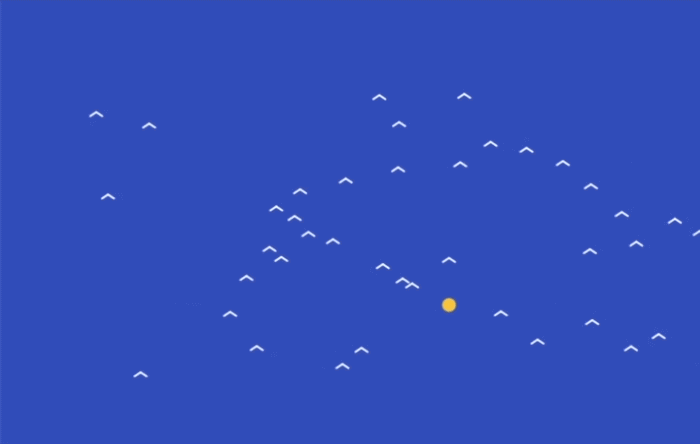

## Add a little wobble

In the `updateBirds()` function, add a tiny random change to `xSpeed` and `ySpeed`. This will stop the birds all moving in exactly the same way.

--- code ---
---
language: javascript
filename: sketch.js
line_numbers: true
line_number_start: 36
line_highlights: 47
---
function updateBirds() {
  for (let bird of birds) {
    bird.xSpeed += (flockTargetX - bird.x) * 0.0008
    bird.ySpeed += (flockTargetY - bird.y) * 0.0008

    let birdSpeed = sqrt(bird.xSpeed * bird.xSpeed + bird.ySpeed * bird.ySpeed)

    if (birdSpeed < 0.01) {
      birdSpeed = 0.01
    }

    bird.xSpeed += random(-0.03, 0.03)
    bird.ySpeed += random(-0.03, 0.03)

    bird.xSpeed = bird.xSpeed / birdSpeed * 2.2
    bird.ySpeed = bird.ySpeed / birdSpeed * 2.2

    bird.x += bird.xSpeed
    bird.y += bird.ySpeed
  }
}
--- /code ---

### Now run your code
This is what you should see when you run your code.

### Tip
{: .c-project-callout .c-project-callout--tip}
- Try smaller random numbers to make the flock calmer.
- Try bigger random numbers to make the flock wobblier and more chaotic.
- Small changes often look best here.

### Debugging
{: .c-project-callout .c-project-callout--debug}
- Make sure both `random()` lines are inside the `for` loop.
- Check that you are using brackets `()` in `random(-0.03, 0.03)`.
- If your birds move too wildly, check that you have not used numbers that are too large.