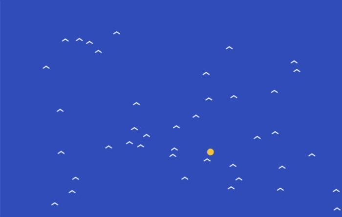

## Stop the birds bumping into each other

### Step 1
In the `updateBirds()` function, add another loop so each bird can look at all the other birds. We also work out how far apart the two birds are.

--- code ---
---
language: javascript
filename: sketch.js
line_numbers: true
line_number_start: 36
line_highlights: 38-40
---
function updateBirds() {
  for (let bird of birds) {
    for (let otherBird of birds) {
      let distanceBetweenBirds = dist(bird.x, bird.y, otherBird.x, otherBird.y)
    }

    bird.xSpeed += (flockTargetX - bird.x) * 0.0008
    bird.ySpeed += (flockTargetY - bird.y) * 0.0008
--- /code ---

### Step 2
Now add an `if` statement. This checks whether the bird is looking at a different bird, and whether they are too close together.

--- code ---
---
language: javascript
filename: sketch.js
line_numbers: true
line_number_start: 36
line_highlights: 41-42
---
function updateBirds() {
  for (let bird of birds) {
    for (let otherBird of birds) {
      let distanceBetweenBirds = dist(bird.x, bird.y, otherBird.x, otherBird.y)

      if (otherBird !== bird && distanceBetweenBirds < 18) {
      }
    }

    bird.xSpeed += (flockTargetX - bird.x) * 0.0008
    bird.ySpeed += (flockTargetY - bird.y) * 0.0008
--- /code ---

### Step 3
Inside the `if` statement, push the bird away from the other bird. This helps the flock spread out instead of piling into one clump.

--- code ---
---
language: javascript
filename: sketch.js
line_numbers: true
line_number_start: 36
line_highlights: 42-43
---
function updateBirds() {
  for (let bird of birds) {
    for (let otherBird of birds) {
      let distanceBetweenBirds = dist(bird.x, bird.y, otherBird.x, otherBird.y)

      if (otherBird !== bird && distanceBetweenBirds < 18) {
        bird.xSpeed += (bird.x - otherBird.x) * 0.01
        bird.ySpeed += (bird.y - otherBird.y) * 0.01
      }
    }

    bird.xSpeed += (flockTargetX - bird.x) * 0.0008
    bird.ySpeed += (flockTargetY - bird.y) * 0.0008
--- /code ---

### Now run your code
This is what you should see when you run your code.

### Tip
{: .c-project-callout .c-project-callout--tip}
- Change `18` if you want the birds to leave more or less space around each other.
- Change `0.01` if you want the birds to push away more strongly or more gently.
- Small changes can make a big difference to how the flock moves. Test it carefully

### Debugging
{: .c-project-callout .c-project-callout--debug}
- Make sure the second `for` loop is inside the first one.
- Check that `otherBird !== bird` uses two `=` signs.
- Make sure the two lines that change `bird.xSpeed` and `bird.ySpeed` are inside the `if` statement.