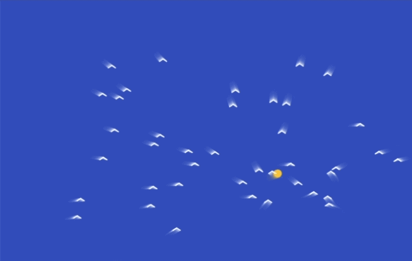

## Leave trails in the sky

### Step 1
In the `draw()` function, add a fourth number to `background()`. This makes the background a little see-through, so the old frames fade away instead of disappearing straight away.

--- code ---
---
language: javascript
filename: sketch.js
line_numbers: true
line_number_start: 17
line_highlights: 18
---
function draw() {
  background(15, 20, 40, 150)
  moveFlockTarget()
  drawFlockTarget()
  updateBirds()
  drawBirds()
}
--- /code ---

### Step 2
Try changing the last number to make the trails longer or shorter. Smaller numbers make longer trails, and bigger numbers make shorter trails.

--- code ---
---
language: javascript
filename: sketch.js
line_numbers: true
line_number_start: 17
line_highlights: 18
---
function draw() {
  background(15, 20, 40, 90)
  moveFlockTarget()
  drawFlockTarget()
  updateBirds()
  drawBirds()
}
--- /code ---

### Now run your code
This is what you should see when you run your code.

### Tip
{: .c-project-callout .c-project-callout--tip}
- Try different values for the last number in `background()`.
- Smaller numbers make longer, ghostly trails.
- Bigger numbers make the trails fade away more quickly.

### Debugging
{: .c-project-callout .c-project-callout--debug}
- Make sure `background()` now has four numbers, separated by commas.