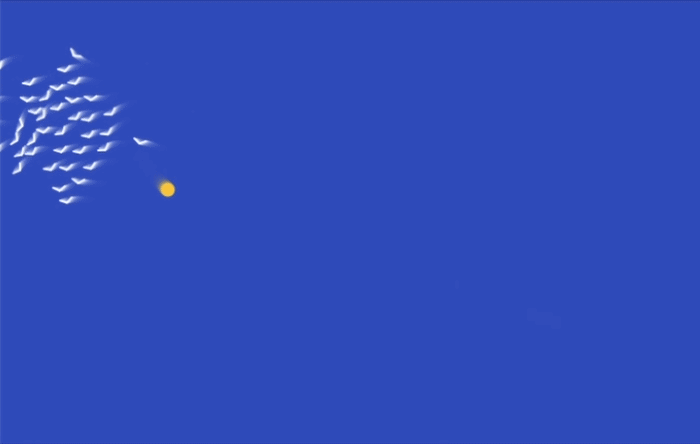

## Point the birds the right way

### Step 1
In the `drawBirds()` function, use `push()` and `pop()` so each bird can be drawn on its own. Then use `translate()` to move the drawing point to the bird's position.

This means the bird is now drawn with `(0, 0)` at its centre, instead of using `bird.x` and `bird.y` in every `line()` command.

--- code ---
---
language: javascript
filename: sketch.js
line_numbers: true
line_number_start: 67
line_highlights: 73-77
---
function drawBirds() {
  stroke(255)
  strokeWeight(2)
  noFill()

  for (let bird of birds) {
    push()
    translate(bird.x, bird.y)
    line(-6, 2, 0, -2)
    line(0, -2, 6, 2)
    pop()
  }
}
--- /code ---

### Step 2
Now add `rotate()` so each bird points in the direction it is flying. `atan2()` works out the angle from the bird's `xSpeed` and `ySpeed`.

--- code ---
---
language: javascript
filename: sketch.js
line_numbers: true
line_number_start: 67
line_highlights: 75
---
function drawBirds() {
  stroke(255)
  strokeWeight(2)
  noFill()

  for (let bird of birds) {
    push()
    translate(bird.x, bird.y)
    rotate(atan2(bird.ySpeed, bird.xSpeed))
    line(-6, 2, 0, -2)
    line(0, -2, 6, 2)
    pop()
  }
}
--- /code ---

### Now run your code
This is what you should see when you run your code.

### Tip
{: .c-project-callout .c-project-callout--tip}
- After using `translate(bird.x, bird.y)`, the middle of the bird is at `(0, 0)`.
- Try changing the line numbers to make your birds wider, taller, or pointier.
- Watch how the birds now turn to face the way they are flying.

### Debugging
{: .c-project-callout .c-project-callout--debug}
- Make sure `push()`, `translate()`, `rotate()`, and `pop()` are all inside the `for` loop.
- Check that you changed both `line()` commands to use the new coordinates.
- If the birds look strange, make sure you used `line(-6, 2, 0, -2)` and `line(0, -2, 6, 2)`.