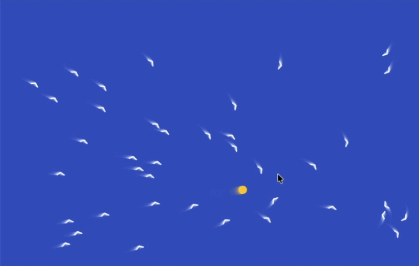

## Scatter the flock with your mouse

### Step 1
In the `mousePressed()` function, make the birds jump away when you click near them. `mouseX` and `mouseY` tell you where the mouse was when you clicked.

--- code ---
---
language: javascript
filename: sketch.js
line_numbers: true
line_number_start: 82
line_highlights: 83-90
---
function mousePressed() {
  for (let bird of birds) {
    let distanceFromMouse = dist(mouseX, mouseY, bird.x, bird.y)

    if (distanceFromMouse < 120) {
      bird.x += (bird.x - mouseX) * 0.2
      bird.y += (bird.y - mouseY) * 0.2
    }
  }
}
--- /code ---

### Step 2
Now also change the bird's speed. This makes the flock burst away more smoothly instead of just jumping.

--- code ---
---
language: javascript
filename: sketch.js
line_numbers: true
line_number_start: 82
line_highlights: 89-90
---
function mousePressed() {
  for (let bird of birds) {
    let distanceFromMouse = dist(mouseX, mouseY, bird.x, bird.y)

    if (distanceFromMouse < 120) {
      bird.x += (bird.x - mouseX) * 0.2
      bird.y += (bird.y - mouseY) * 0.2
      bird.xSpeed += (bird.x - mouseX) * 0.02
      bird.ySpeed += (bird.y - mouseY) * 0.02
    }
  }
}
--- /code ---

### Now run your code
This is what you should see when you run your code.

### Tip
{: .c-project-callout .c-project-callout--tip}
- Change `120` if you want your click to affect birds from further away or closer up.
- Change `0.2` if you want the birds to jump a bigger or smaller distance.
- Change `0.02` if you want the birds to speed away more gently or more dramatically.

### Debugging
{: .c-project-callout .c-project-callout--debug}
- Make sure `mousePressed()` is spelled exactly like this, with a capital `P`.
- Make sure the lines that change the bird are inside the `if` statement.