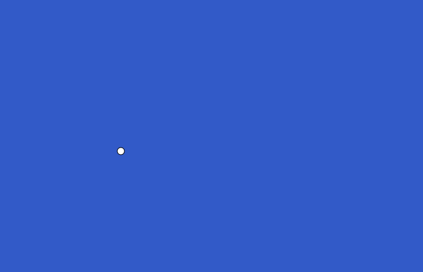

## Add your first bird

### Step 1
Create an array that will contain all your birds. `let` is used in JavaScript to create new objects.

--- code ---
---
language: javascript
filename: sketch.js
line_numbers: true
line_number_start: 1
line_highlights: 1
---
let birds = []

function setup() {
  createCanvas(700, 450)
}
--- /code ---

### Step 2
In the `setup()` function, add one bird to the `birds` list. The `birds.push()` line adds a new bird for your program to draw.

--- code ---
---
language: javascript
filename: sketch.js
line_numbers: true
line_number_start: 3
line_highlights: 6-7
---
function setup() {
  createCanvas(700, 450)

  birds.push({
  })
}
--- /code ---

### Step 3
Inside the curly brackets, choose a starting `x` and `y` position for your bird, and a starting speed This decides where it appears on the canvas.

--- code ---
---
language: javascript
filename: sketch.js
line_numbers: true
line_number_start: 3
line_highlights: 7-10
---
function setup() {
  createCanvas(700, 450)

  birds.push({
    x: 200,
    y: 250,
    xSpeed: 2,
    ySpeed: -1
  })
}
--- /code ---

### Step 4
In the `drawBirds()` function, draw a circle for each bird in the array. There's only one at the moment, at the `x` and `y` postion you chose.

--- code ---
---
language: javascript
filename: sketch.js
line_numbers: true
line_number_start: 31
line_highlights: 32-34
---
function drawBirds() {
  for (let bird of birds) {
    ellipse(bird.x, bird.y, 12, 12)
  }
}
--- /code ---

### Now run your code
This is what you should see when you run your code.

### Tip
{: .c-project-callout .c-project-callout--tip}

- Try changing the `x` and `y` values in the `setup()` function to place your bird in a different part of the canvas.
- The last two numbers in the `ellipse()` function will change the size of your bird.

### Debugging
{: .c-project-callout .c-project-callout--debug}

- Make sure you use commas between each piece of information.
- Check that you have opened and closed both curly brackets `{}`.