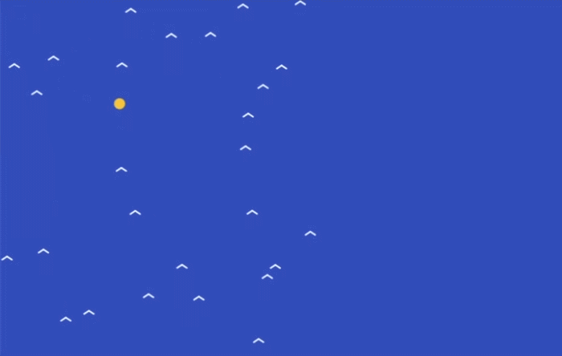

## Make the birds follow the target

### Step 1
In the `updateBirds()` function, make each bird turn towards the target from left to right. If the target is to the right, the bird speeds up to the right. If the target is to the left, it slows down or turns left.

--- code ---
---
language: javascript
filename: sketch.js
line_numbers: true
line_number_start: 36
line_highlights: 38
---
function updateBirds() {
  for (let bird of birds) {
    bird.xSpeed += (flockTargetX - bird.x) * 0.0008
    bird.x += bird.xSpeed
    bird.y += bird.ySpeed
  }
}
--- /code ---

### Step 2
Now make each bird turn towards the target up and down as well. This helps the whole flock follow the moving target through the sky.

--- code ---
---
language: javascript
filename: sketch.js
line_numbers: true
line_number_start: 1
line_highlights: 4
---
function updateBirds() {
  for (let bird of birds) {
    bird.xSpeed += (flockTargetX - bird.x) * 0.0008
    bird.ySpeed += (flockTargetY - bird.y) * 0.0008
    bird.x += bird.xSpeed
    bird.y += bird.ySpeed
  }
}
--- /code ---

### Now run your code
This is what you should see when you run your code.

### Tip
{: .c-project-callout .c-project-callout--tip}
- Try changing `0.0008` to make the birds turn more gently or more strongly.
- Smaller numbers make the birds turn slowly.
- Bigger numbers make the birds chase the target more quickly.

### Debugging
{: .c-project-callout .c-project-callout--debug}
- Make sure both new lines are inside the `for` loop.
- Check that you have typed `flockTargetX` and `flockTargetY` correctly.
- Make sure the brackets around `(flockTargetX - bird.x)` and `(flockTargetY - bird.y)` are included.