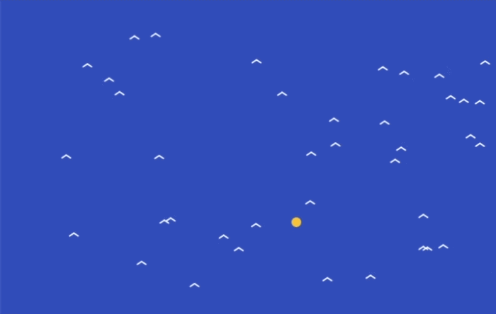

## Keep the flock flying smoothly

### Step 1
In the `updateBirds()` function, work out how fast each bird is moving. This uses Pythagoras to combine the `xSpeed` and `ySpeed` into one speed.

--- code ---
---
language: javascript
filename: sketch.js
line_numbers: true
line_number_start: 36
line_highlights: 41
---
function updateBirds() {
  for (let bird of birds) {
    bird.xSpeed += (flockTargetX - bird.x) * 0.0008
    bird.ySpeed += (flockTargetY - bird.y) * 0.0008

    let birdSpeed = sqrt(bird.xSpeed * bird.xSpeed + bird.ySpeed * bird.ySpeed)

    bird.x += bird.xSpeed
    bird.y += bird.ySpeed
  }
}
--- /code ---

### Step 2
Sometimes a bird might almost stop moving. Add an `if` statement to make sure the speed never gets too close to zero.

--- code ---
---
language: javascript
filename: sketch.js
line_numbers: true
line_number_start: 36
line_highlights: 43-45
---
function updateBirds() {
  for (let bird of birds) {
    bird.xSpeed += (flockTargetX - bird.x) * 0.0008
    bird.ySpeed += (flockTargetY - bird.y) * 0.0008

    let birdSpeed = sqrt(bird.xSpeed * bird.xSpeed + bird.ySpeed * bird.ySpeed)

    if (birdSpeed < 0.01) {
      birdSpeed = 0.01
    }

    bird.x += bird.xSpeed
    bird.y += bird.ySpeed
  }
}
--- /code ---

### Step 3
Now make every bird fly at the same speed. Change `2.2` to choose how fast your flock should fly.

--- code ---
---
language: javascript
filename: sketch.js
line_numbers: true
line_number_start: 36
line_highlights: 47-48
---
function updateBirds() {
  for (let bird of birds) {
    bird.xSpeed += (flockTargetX - bird.x) * 0.0008
    bird.ySpeed += (flockTargetY - bird.y) * 0.0008

    let birdSpeed = sqrt(bird.xSpeed * bird.xSpeed + bird.ySpeed * bird.ySpeed)

    if (birdSpeed < 0.01) {
      birdSpeed = 0.01
    }

    bird.xSpeed = bird.xSpeed / birdSpeed * 2.2
    bird.ySpeed = bird.ySpeed / birdSpeed * 2.2

    bird.x += bird.xSpeed
    bird.y += bird.ySpeed
  }
}
--- /code ---

### Now run your code
This is what you should see when you run your code.

### Tip
{: .c-project-callout .c-project-callout--tip}
- Try changing `2.2` to make your whole flock fly faster or slower.
- Birds that all fly at a similar speed often look more like a real flock.
- If your birds look too jumpy, try a slightly smaller speed.

### Debugging
{: .c-project-callout .c-project-callout--debug}
- Make sure `birdSpeed` is spelled the same way each time.
- Check that the `if` statement uses curly brackets `{}`.
- Make sure the two new `bird.xSpeed =` and `bird.ySpeed =` lines are inside the `for` loop.